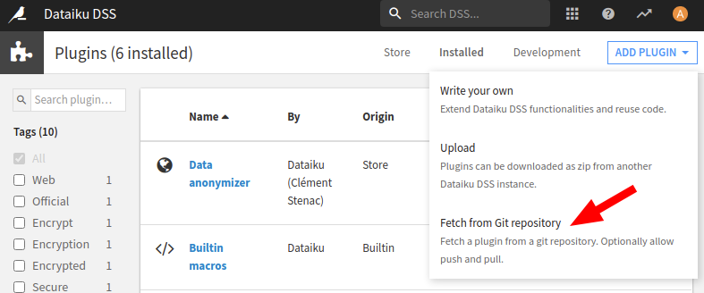
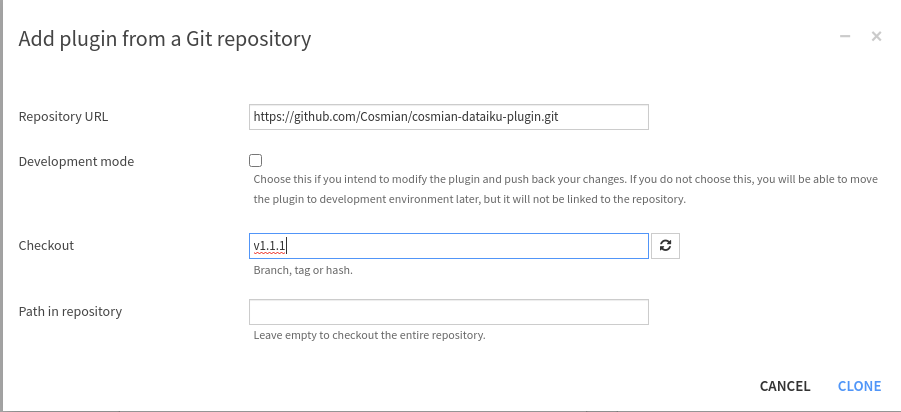

# Cosmian Dataiku Plugin

This plugin facilitates the Integration between Dataiku and the Cosmian CipherCompute and ZeroTrust servers.

## Installing in Dataiku

Please see paragraphs below on installing Dataiku DSS 8 (this plugin is compatible with DSS 9).

Go to Applications -> Plugins -> Add Plugins --> Fetch from Git repository



Then enter the HTTPS Clone URL of this repository

Use `v1.1.1` for CipherCompute v1.1.1, v1.1.2




## Installing Python 3.6

DSS 8 requires Python 3.6 (not 3.8). To install on Ubuntu/Debian

1. Install dependencies

```
sudo apt update

sudo apt-get install libreadline-gplv2-dev libncursesw5-dev libssl-dev libsqlite3-dev tk-dev libgdbm-dev libc6-dev libbz2-dev
```

2. Fetch Python 3.6.8 and install

```
wget https://www.python.org/ftp/python/3.6.8/Python-3.6.8.tar.xz

tar xvf Python-3.6.8.tar.xz

cd Python-3.6.8

./configure

make -j 8 && sudo make altinstall
```

3. Check

Python 3.6 should be available in `/usr/local/bin/`

`python3 --version` should return whatever it was before e.g. `Python 3.8.5`


## DSS install

Follow instructions at :

https://www.dataiku.com/product/get-started/linux/


```
sudo apt install acl libncurses5 nginx unzip zip default-jre-headless python2.7 libpython2.7

wget https://cdn.downloads.dataiku.com/public/dss/8.0.5/dataiku-dss-8.0.5.tar.gz

tar xzf dataiku-dss-8.0.5.tar.gz

export DATA_DIR=~/dss && dataiku-dss-8.0.5/installer.sh -d ${DATA_DIR} -p 8080

```


## DSS start

`DATA_DIR` is the data directory chosen during install 

    ${DATA_DIR}/bin/dss start


## Add the Plugin to DSS

Go to http://localhost:11000/plugins-explore/store/ 

-> Add Plugin Button

-> Fetch from git repository

When asked, build the environment using PYTHON36


## DSS plugin development

First register to the [Dataiku Academy](https://academy.dataiku.com/plugin-development/514705)
and follow environment install instructions on that page

Introduction also available in this [documentation](https://doc.dataiku.com/dss/latest/plugins/reference/index.html?highlight=plugin%20development)

Select the created dataiku_dev_env environment when developing.

Dataiku:

 - [parameters types](https://doc.dataiku.com/dss/latest/plugins/reference/params.html)

## Cosmian developers

For simplicity the cosmian_lib must be packaged inside the plugin.
An easy way to guarantee synchronization is to:

- develop changes inside the cosmian_server/python/cosmian_lib directory (i.e. the reference source)
- then synchronize the changes into the python-lib/ directory by running from the root of thi project:

        rsync -a ../cosmian_server/python/cosmian_lib python-lib --exclude=__pycache__ 

This should be run once at first; the .env directory will help vscode pickup the library

